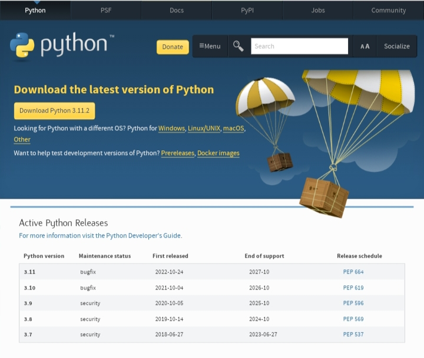
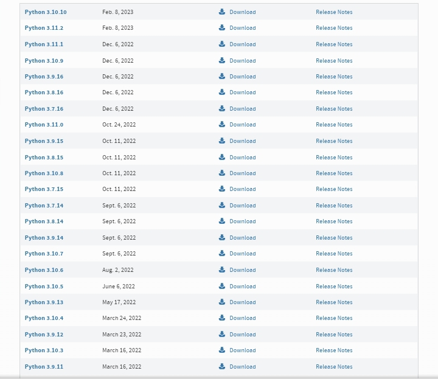

# python-beginners-guide
Hello everyone this is just a simple repository to get you some basic knowledge of of python programs, Also please note that this repository shouldn't be misused for Harassing Abusing or Spamming others, if any of the above mentioned occurs then I'm not responsible for anything 
|-------|

# How to install python
It's very simple just go to python's official website 
or just click below -



<a href="https://www.python.org/downloads/">

```
https://www.python.org/downloads/
```
</a>

It would look like this, install it as your requirement -


`
After installation is done open your terminal and type the following command to confirm if it has been correctly installed or not
`

```
python
```

Or

```
pip 
```

`
Also note that pip is a command in python which is automatically installed during the python installation 
`

# How to download older versions of python

`
However if you want to download older versions, scroll down then it will basically show like this 
`



`
Once you reach this part download the version of your choice 
`

# How to open python


Once done check go to your task bar (if you are on windows) and on the search box type IDLE Python and click on first option which appears and you are all set :)

# Knowing about two shells (mode) of python 

Basics before starting to code in python 

<br>

`
Python has two modes to work on with, first it has the interactive mode which is used for generating simple outputs and second the script mode which is used for making many complex programs, also here script mode is necessary to for lengthy programs because in the interactive mode the outputs of the statements are rather compressed between the statements and in the interactive mode the output can be obtained by pressing F5 on our keyboard whenever we are done coding 
`

<br>

The Interactive Mode (Shell) looks somewhat like this -


And The Script Mode (Shell) looks somewhat like this -


<br>

Learn more about this modes here , click the link below -
<a href="https://www-geeksforgeeks-org.cdn.ampproject.org/v/s/www.geeksforgeeks.org/what-is-the-difference-between-interactive-and-script-mode-in-python-programming/amp/?amp_gsa=1&amp_js_v=a9&usqp=mq331AQIUAKwASCAAgM%3D#amp_tf=From%20%251%24s&aoh=16795850663044&referrer=https%3A%2F%2Fwww.google.com&ampshare=https%3A%2F%2Fwww.geeksforgeeks.org%2Fwhat-is-the-difference-between-interactive-and-script-mode-in-python-programming%2F">

```
https://www-geeksforgeeks-org.cdn.ampproject.org/v/s/www.geeksforgeeks.org/what-is-the-difference-between-interactive-and-script-mode-in-python-programming/amp/?amp_gsa=1&amp_js_v=a9&usqp=mq331AQIUAKwASCAAgM%3D#amp_tf=From%20%251%24s&aoh=16795850663044&referrer=https%3A%2F%2Fwww.google.com&ampshare=https%3A%2F%2Fwww.geeksforgeeks.org%2Fwhat-is-the-difference-between-interactive-and-script-mode-in-python-programming%2F
```
</a>

<br>

Let's start with some basic program in the interactive mode after that we would be moving to the script mode
|----|
# Commad to print Hello World in Python in the interactive mode 

```
print("Hello World")
```

After typing this the output comes in this format

Hello World 
|---|

Please note that there is a difference between `Print` & `print`,
You can find more information about keywords of python here -

<a href="https://www.programiz.com/python-programming/keyword-list">

```
https://www.programiz.com/python-programming/keyword-list
```
</a>

# Now Let's create a simple hello world programe in the script mode 

To open the script shell, just press
```
Ctrl + N
```

On your keyboard

And then the script shell will open

After that type the code below to get the output -

```
print("Hello World")
```

Or you can assign Hello World to a variable and print the value of the variable by the following code -

```
mytext = "Hello World"
print (mytext)
```

Too know more about variables in python, click on the link below -

<a href="https://www.w3schools.com/python/python_variables.asp">

```
https://www.w3schools.com/python/python_variables.asp
```
</a>

# More info-

`
Meanwhile check this out-
`

```
Hello everyone thanks for paying a visit 
to this repository and to the .If you 
all Have any feedback/issues/bugs 
feel free to email me at the 
email address provided in the 
README.md file or post it in the discussion,
I would try my best to update it 
as soon as possible within 4-5days time 
interval it would be fixed and upgraded 
to a better version which would improve 
your experience.Btw Make sure to pay 
a visit to this repository 
after 3-4 days time interval 
to check what has changed,
If not possible it can be checked 
after a week. 
Anyways thanks for reading
Have a nice day :) 👍
```

# Check SECURITY.md for more info about security policy or click down in that box-

<a href="./SECURITY.md"> 

```
Check SECURITY.md for more info or click here.
```
</a>


<!--[![leisure]-->
`
Fun link.Click Down👇
`

<a href="https://i.pinimg.com/originals/b2/2a/a2/b22aa22b2f3f55b6468361158d52e2e7.gif" target="_blank">

</a>

<a href="https://p.favim.com/orig/2018/11/05/kawaii-8-bit-gif-Favim.com-6490317.gif" target="_blank">

</a>

# My Email For Any Queries-
- 📫 How to reach me ... you can reach me by mailing me at this email address just click once at the blue colored text - 
<a href="mailto:blazinginfernodragon123@gmail.com" target="_blank">

```
BlazingInfernoDragon123@gmail.com
```
</a>

`
Want to email directly ?Click Down👇
`

<a href="mailto:blazinginfernodragon123@gmail.com" target="_blank">

</a>


`
Thank u for reading have a nice day :)
`

# Visitor count -
<p align="center"> 

`
  Visitor count
`
<br>
  
</p>


# Our YouTube Channel Link-
Our YouTube Channel Link Plss subscribe -

<a href="https://youtube.com/channel/UCsdLD0oB8Ui9EEE9WNSAAug" target="_blank">

```
BlazingInfernoDragon123 Channel
```
</a>

<!-- YouTube -->

<!-- Github -->

`
Want to subscribe to our channel directly ?Click Down👇
`

<a href="https://youtube.com/channel/UCsdLD0oB8Ui9EEE9WNSAAug" target="_blank">

</a>

# Google Forms File Upload 

<!--[![patreon]-->
`
Got any files to show me?Click Down👇
`

<a href="https://forms.gle/y6YSBnyNvnrhgrKg9" target="_blank">

</a>


# My Other Following Links 🔗 - 

<!-- Github -->

`
Want to follow me on github?Click Down👇
`

<a href="https://github.com/blaizinginfernodragon123?tab=following" target="_blank">

</a>

<!--[![patreon]-->
`
Support me on patreon?Click Down👇
`

<a href="https://patreon.com/blaizinginfernodragon123" target="_blank">

</a>

